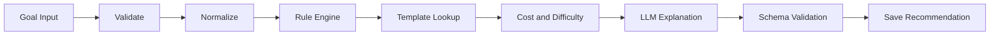
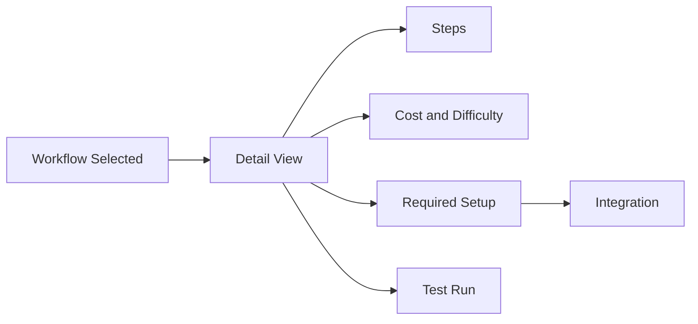
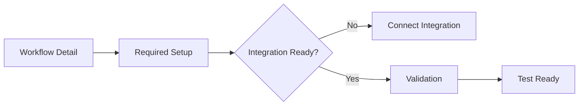
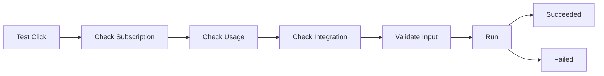
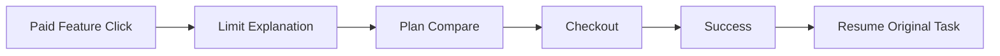
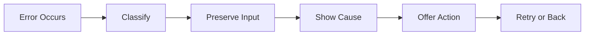

# BuildFlow

## User Flow

- Version: 1.0
- Status: Draft
- Brand Name: BuildFlow
- Internal Codename: Project Flow
- Document Owner: Founder
- Last Updated: 2026-07-14
- Related Documents:
  - `docs/00-brand.md`
  - `docs/01-prd.md`
  - `docs/02-information-architecture.md`
  - `docs/04-mvp.md`

## 1. Document Purpose

이 문서는 BuildFlow MVP에서 사용자가 어떤 순서로 행동하고, 시스템이 어떻게 반응해야 하는지를 정의한다. 화면 간 전환 기준, 정상 흐름, 예외 흐름, 실패 복구 흐름, 인증과 구독과 Usage와 Integration 상태에 따른 분기를 함께 정리한다. 이 문서는 UX 설계와 API 구현이 같은 기준을 공유하도록 돕는다. 또한 MVP 출시 전에 핵심 흐름이 실제로 작동하는지 검증하는 기준이 된다.

Information Architecture는 정보와 화면 구조를 정의한다. User Flow는 사용자의 행동과 시스템 반응을 정의한다.

## 2. Flow Design Principles

### 1. Goal First

사용자는 Tool이 아니라 만들고 싶은 결과를 먼저 입력한다. 모든 핵심 Flow는 목표에서 시작한다.

### 2. Minimum Required Input

Recommendation을 만들기 전에 필요한 최소 입력만 받는다. 불필요한 정보는 나중에 보완할 수 있다.

### 3. Progressive Questions

모호한 목표는 한 번에 끝내지 않고 단계적으로 질문한다. 질문은 선택형을 우선하고, 필요한 경우에만 추가 질문을 한다.

### 4. Preview Before Commitment

가입 전에는 전체 결과가 아니라 제한된 Preview를 보여준다. 사용자는 먼저 가치를 확인한 뒤 가입한다.

### 5. Explain Before Paywall

유료 제한이 걸리는 지점에서는 먼저 이유와 가치를 설명한다. 사용자가 왜 막히는지 이해할 수 있어야 한다.

### 6. Save Before Setup

Workflow 선택과 저장을 먼저 하고, 그다음 준비와 연동으로 넘어간다. 저장 없이 실행 준비만 강요하지 않는다.

### 7. Setup Before Execution

실행은 준비가 끝난 뒤에만 진행한다. 필요한 계정, API, OAuth 상태를 먼저 확인한다.

### 8. Recoverable Failure

오류가 발생해도 흐름이 끊기지 않아야 한다. 실패는 복구 가능해야 하고 다음 행동이 명확해야 한다.

### 9. Preserve User Input

실패나 로그인 전환이 있어도 사용자가 입력한 Goal과 조건은 보존한다. 같은 내용을 다시 입력하게 만들지 않는다.

### 10. One Clear Next Action

각 화면은 하나의 다음 행동을 보여준다. 사용자가 여러 선택지에 동시에 압도되지 않도록 한다.

### 11. Beginner-Friendly Guidance

초기 사용자는 API, OAuth, n8n에 익숙하지 않다. 따라서 용어 설명과 준비 안내를 함께 제공한다.

### 12. No False Execution Promise

모든 Workflow를 자동 실행할 수 있다고 말하지 않는다. 지원 범위와 제한을 분명히 표시한다.

다음 결정도 적용한다.

- 사용자는 Tool을 먼저 선택하지 않는다.
- 목표 입력이 모든 핵심 Flow의 시작점이다.
- Recommendation 생성 전에 불필요한 정보를 과도하게 요구하지 않는다.
- 가입 이전에 제한된 가치를 보여줄 수 있다.
- 실행 지원 여부는 Workflow 상세에서 명확히 구분한다.
- 오류가 발생해도 목표와 입력값을 잃지 않게 한다.

## 3. User Entry Points

| Entry Point | 사용자 의도 | 도착 화면 | Primary Action |
| --- | --- | --- | --- |
| 직접 방문 | 서비스 탐색 | Landing | 목표 입력 |
| 검색 엔진 | 특정 자동화 방법 탐색 | Example 또는 Tool Page | Workflow 확인 |
| 공유 링크 | 특정 Workflow 확인 | Example Detail | 비슷한 목표 설계 |
| 로그인 재방문 | 기존 Project 관리 | Dashboard | Project 이어서 진행 |
| 이메일 링크 | Recommendation 또는 실행 결과 확인 | 관련 Project | 상태 확인 |
| 결제 완료 복귀 | Pro 기능 사용 | Billing Return 또는 Dashboard | 계속 진행 |

초기 MVP의 핵심 Entry Point는 Landing과 Dashboard다.

## 4. User State Model

```text
Visitor
Authenticated / Minimal Profile
Free User
Pro User
Admin
```

| State | 가능한 행동 | 제한 | 다음 주요 행동 |
| --- | --- | --- | --- |
| Visitor | Landing 접근, 목표 입력, 제한 Preview 확인 | 저장, 전체 Recommendation, 실행 불가 | Signup |
| Authenticated / Minimal Profile | 로그인 후 기본 기능 접근 | 개인화 기본값 부족 | 새 프로젝트 생성에서 최소 조건 입력 |
| Free User | 제한 Recommendation, Project 저장, 일부 Preview | 전체 추천, 일부 Integration, 대부분의 실행 제한 | Upgrade 또는 계속 탐색 |
| Pro User | 전체 Recommendation, 상세 설계, 연결, 테스트 실행 | 플랜 한도와 지원 범위 제한 | Workflow 저장 및 실행 |
| Admin | Tool 관리, Template 관리, 가격 정보 관리 | 일반 사용자 흐름과 분리 | 운영 데이터 관리 |

```text
Visitor
→ Signup
→ Authenticated
→ 새 프로젝트 생성에서 최소 조건 입력
→ Free User
→ Upgrade
→ Pro User
```

별도 Onboarding Route는 초기 Beta에서 제외한다.

## 5. Primary End-to-End Flow

```text
Landing
→ 목표 입력
→ 제한된 Preview 또는 조건 입력
→ 회원가입
→ 새 프로젝트 생성에서 최소 조건 입력
→ Project 생성
→ Recommendation 생성
→ Workflow 후보 비교
→ Workflow 선택
→ Workflow 상세 확인
→ Project에 저장
→ 필요한 준비 확인
→ Integration 연결
→ 테스트 실행
→ 결과 확인
→ Dashboard에서 관리
```

| 단계 | 사용자 행동 | 시스템 처리 | 성공 조건 | 실패 시 이동 |
| --- | --- | --- | --- | --- |
| Landing | 목표 입력 시작 | 입력 폼 표시, 기본 안내 제공 | 사용자가 Goal 입력을 시작함 | Preview 또는 예외 메시지 |
| 목표 입력 | 만들고 싶은 결과 입력 | 목표 유효성 검사 | 추천 가능한 수준의 Goal 확보 | Clarification 또는 수정 |
| 제한된 Preview 또는 조건 입력 | 제한 Preview 확인 또는 조건 보완 | Preview 생성, 조건 수집 | 다음 단계로 이동 가능 | Signup 또는 재입력 |
| 회원가입 | 이메일 또는 Google 선택 | 계정 생성, 세션 발급 | 인증된 사용자 상태 진입 | Signup 오류 처리 |
| Onboarding | 별도 Route 없음 | 최소 조건을 Project 입력 과정에서 수집 | 개인화 기본값 확보 | 새 프로젝트로 복귀 |
| Project 생성 | 새 Project 생성 | Project 레코드 생성 | 목표 단위가 저장됨 | 생성 실패 복구 |
| Recommendation 생성 | 후보 생성 요청 | Rule Engine, Template, LLM 처리 | 구조화된 결과 생성 | 실패 메시지와 재시도 |
| Workflow 후보 비교 | 후보 비교 | 비용, 난이도, 시간 비교 | 후보 차이를 이해함 | 목표 수정 또는 재생성 |
| Workflow 선택 | 하나의 후보 선택 | Selected Workflow 저장 | 선택 결과가 Project에 연결됨 | 다른 후보 재선택 |
| Workflow 상세 확인 | 준비와 실행 조건 확인 | 단계, Tool, 비용 노출 | 실행 준비를 이해함 | Setup 화면으로 이동 |
| Project에 저장 | 선택 결과 저장 | Workflow Version 저장 | 재방문 가능 | 저장 실패 복구 |
| 필요한 준비 확인 | 계정과 API 확인 | Integration 필요 여부 표시 | 준비 항목이 명확함 | Integration 연결 화면 |
| Integration 연결 | OAuth 또는 API Key 연결 | 연결 검증, 암호화 저장 | 연결 상태가 Connected | 오류 복구 |
| 테스트 실행 | 테스트 요청 | 실행 검증 및 진행 상태 관리 | Succeeded 또는 Failed 결과 확보 | 실패 복구 또는 재시도 |
| 결과 확인 | 실행 결과 검토 | 로그, 결과, 다음 행동 표시 | 결과를 이해하고 다음 행동 가능 | 재시도, 수정, Setup |
| Dashboard에서 관리 | 상태 확인 및 재진입 | Project, Usage, 최근 작업 표시 | 이후 관리 가능 | 다시 로그인 또는 복원 |

### End-to-End Flow Diagram

```mermaid
flowchart LR
  A[Landing] --> B[Goal Input]
  B --> C[Preview or Conditions]
  C --> D[Signup]
  D --> E[New Project Minimum Inputs]
  E --> F[Create Project]
  F --> G[Generate Recommendation]
  G --> H[Compare Candidates]
  H --> I[Select Workflow]
  I --> J[Workflow Detail]
  J --> K[Save Project]
  K --> L[Required Setup]
  L --> M[Connect Integration]
  M --> N[n8n Handoff]
  N --> O[View Result]
  O --> P[Dashboard]
```



## 6. Visitor Goal Preview Flow

### 정상 흐름

```text
Landing
→ 목표 입력
→ 기본 유효성 검사
→ 제한 Preview 생성
→ 핵심 Workflow 방향 표시
→ 전체 결과 확인 CTA
→ Signup
→ 입력값 복원
→ Project 생성
→ 전체 Recommendation 생성
```

### 요구사항

- Signup 전 입력값을 보존한다.
- 브라우저 저장 또는 안전한 임시 상태를 사용할 수 있다.
- 비로그인 사용자에게 전체 Workflow를 모두 제공하지 않는다.
- Preview만으로도 제품의 가치를 이해할 수 있어야 한다.
- 가입 후 같은 내용을 다시 입력하게 하지 않는다.
- Preview 범위는 P1에서 검토한다.

### 실패 흐름

- 입력이 너무 짧음
- 목표가 모호함
- 지원하지 않는 요청
- 생성 요청 실패
- Rate Limit
- 네트워크 오류

| 실패 상황 | 사용자 메시지 | 다음 행동 | 입력 보존 |
| --- | --- | --- | --- |
| 입력이 너무 짧음 | 목표를 조금 더 자세히 입력해 주세요. | 입력 수정 | 보존 |
| 목표가 모호함 | 어떤 결과를 만들고 싶은지 조금 더 알려 주세요. | 보완 질문 응답 | 보존 |
| 지원하지 않는 요청 | 현재는 이 유형의 요청을 지원하지 않습니다. | 예시 보기 또는 다른 목표 입력 | 보존 |
| 생성 요청 실패 | 미리보기를 만들지 못했습니다. 다시 시도해 주세요. | 재시도 | 보존 |
| Rate Limit | 잠시 후 다시 시도해 주세요. | 대기 후 재시도 | 보존 |
| 네트워크 오류 | 연결이 불안정합니다. 다시 시도해 주세요. | 재시도 | 보존 |

## 7. Signup Flow

다음 Signup 방식을 정의한다.

- Email
- Google OAuth

GitHub 로그인은 초기 타겟이 비개발자이므로 MVP 필수 대상이 아니다.

### Email Signup

```text
Signup
→ 이메일 입력
→ 비밀번호 입력
→ 약관 동의
→ 계정 생성
→ 이메일 확인 필요 여부 안내
→ 새 프로젝트 생성에서 최소 조건 입력 또는 Dashboard
```

### Google Signup

```text
Signup
→ Google 선택
→ OAuth
→ Callback
→ 신규 사용자 확인
→ Profile 생성
→ 새 프로젝트 생성에서 최소 조건 입력 또는 Dashboard
```

### 예외 흐름

- 이미 존재하는 이메일
- 잘못된 이메일
- 약한 비밀번호
- OAuth 취소
- OAuth Callback 실패
- 이메일 확인 미완료
- Session 생성 실패

| 실패 상황 | 사용자 메시지 | 입력 보존 |
| --- | --- | --- |
| 이미 존재하는 이메일 | 이미 사용 중인 이메일입니다. 로그인하거나 다른 이메일을 사용해 주세요. | 보존 |
| 잘못된 이메일 | 이메일 형식을 확인해 주세요. | 보존 |
| 약한 비밀번호 | 비밀번호를 더 안전하게 입력해 주세요. | 보존 |
| OAuth 취소 | 로그인 작업이 취소되었습니다. 다시 시도해 주세요. | 보존 |
| OAuth Callback 실패 | 인증이 완료되지 않았습니다. 다시 시도해 주세요. | 보존 |
| 이메일 확인 미완료 | 이메일 확인 후 계속 진행해 주세요. | 보존 |
| Session 생성 실패 | 로그인 세션을 만들지 못했습니다. 다시 시도해 주세요. | 보존 |

## 8. Login Flow

### 정상 흐름

```text
Login
→ 인증
→ 원래 요청한 페이지 확인
→ Session 생성
→ Redirect
```

Redirect 우선순위:

1. 사용자가 접근하려던 보호 페이지
2. 최소 프로필 필요 상태
3. Dashboard

### 예외 흐름

- 이메일 또는 비밀번호 오류
- 이메일 미확인
- OAuth 실패
- 계정 비활성화
- Session 만료
- 너무 많은 로그인 시도
- 잘못된 Redirect URL

Open Redirect를 방지해야 한다.

## 9. Onboarding Flow

별도 Onboarding Flow는 초기 Beta에서 제외한다. 필요한 최소 정보는 새 프로젝트 생성 과정에서 수집한다.

### 수집 후보

- AI 숙련도
- 개발 가능 여부
- 주요 사용 목적
- 현재 사용하는 Tool
- 월간 예상 예산
- 선호 자동화 수준

### 정상 흐름

```text
Welcome
→ 숙련도
→ 사용 목적
→ 현재 Tool
→ 예산과 자동화 수준
→ 확인
→ Profile 저장
→ Dashboard 또는 복원된 Project
```

### 원칙

- 질문 수를 최소화한다.
- 나중에 설정에서 수정 가능하다.
- Project별 조건이 기본 프로필 값을 덮어쓸 수 있다.
- 모든 질문을 필수로 만들지 않는다.
- 별도 Onboarding Skip 여부는 초기 Beta에서 적용하지 않는다.
- 별도 Onboarding 미완료 사용자의 접근 제한 범위는 해당되지 않는다.

## 10. New Project Flow

### 정상 흐름

```text
새 프로젝트
→ 목표 입력
→ 목표 유효성 검사
→ 추가 조건 입력
→ 입력 요약
→ Recommendation 생성
```

### Goal 입력

필수:

- 만들고 싶은 결과

선택:

- 추가 설명

### 조건 입력

- 사용 목적
- 현재 Tool
- AI 숙련도
- 개발 가능 여부
- 예산
- 예상 실행량
- 자동화 수준
- 결과물 형태
- 개인정보 포함 여부

### 결정 원칙

- 초기에 모든 조건을 강제하지 않는다.
- 답하지 않은 조건에는 Profile 또는 안전한 기본값을 사용한다.
- Recommendation 품질에 결정적인 질문만 필수로 한다.
- 사용자가 “잘 모르겠어요”를 선택할 수 있게 한다.

### 예외 흐름

- 목표가 모호함
- 목표가 너무 광범위함
- 지원 범위를 벗어남
- 개인정보 또는 민감정보 위험
- 예산과 목표가 충돌함
- 실행량이 비현실적으로 큼

각 경우에 수정 질문을 제공한다.

## 11. Goal Clarification Flow

```text
Goal 입력
→ Goal Normalization
→ 명확성 평가
→ 충분히 명확함: Recommendation 생성
→ 불명확함: Clarification Question
→ 사용자 응답
→ Goal 업데이트
→ Recommendation 생성
```

Clarification Question은 최대한 선택형을 우선한다.

예시:

```text
“쇼츠를 만들고 싶어요.”

어떤 부분까지 자동화하고 싶나요?

1. 아이디어와 대본 생성
2. 음성 생성
3. 영상 생성과 편집
4. 업로드까지 전체 자동화
5. 아직 잘 모르겠어요
```

질문 횟수는 최소화하며 정확한 최대 횟수는 `TBD`다.

## 12. Recommendation Generation Flow

### 시스템 처리

```text
Input Validation
→ Goal Normalization
→ Category Classification
→ Rule Engine
→ Workflow Template Retrieval
→ Tool Compatibility Check
→ Cost Calculation
→ Difficulty Calculation
→ LLM Explanation
→ Schema Validation
→ Recommendation 저장
→ 결과 표시
```

### 사용자 화면 상태

```text
Preparing
Analyzing Goal
Finding Workflow
Calculating Cost
Creating Explanation
Completed
```

내부 처리 단계를 사용자에게 지나치게 기술적으로 노출하지 않는다.

### 실패 흐름

- Rule 결과 없음
- 적합한 Template 없음
- Tool 가격 정보 부족
- LLM Timeout
- LLM Invalid Schema
- Subscription Limit
- 중복 요청
- 서버 오류

### 복구 원칙

- 입력을 보존한다.
- 실패한 Recommendation 상태를 기록한다.
- 재시도 가능 여부를 표시한다.
- 비용이 발생한 요청의 중복 실행을 방지한다.
- 일부 결과가 유효하면 Partial Result를 검토할 수 있다.

### Recommendation Flow Diagram



## 13. Recommendation Result Flow

### 정상 흐름

```text
Recommendation 완료
→ Primary Workflow 확인
→ Alternative 비교
→ 비용, 난이도, 구축 시간 확인
→ 추천 이유와 제한 확인
→ Workflow 선택 또는 조건 수정
```

사용자 행동:

- Primary Workflow 선택
- Alternative 선택
- 후보 상세 비교
- Goal 수정
- 조건 수정
- Recommendation 다시 생성
- 결과 저장
- 종료

### 후보 비교 기준

- 예상 결과
- 예상 비용
- 난이도
- 구축 시간
- 필요한 Tool
- 개발 필요 여부
- 실행 지원 수준
- 주요 제한

초기 후보 개수는 최대 3개로 확정한다.

## 14. Workflow Selection Flow

```text
후보 선택
→ 선택 확인
→ Project의 Selected Workflow 생성
→ Workflow Version 저장
→ Workflow 상세로 이동
```

### 선택 시 원칙

- Recommendation 후보 원본과 선택된 Workflow를 분리한다.
- 선택 후에도 다른 후보를 다시 볼 수 있다.
- 다른 후보로 변경 시 기존 Workflow Version 처리 정책은 `TBD`다.
- 선택과 동시에 실행하지 않는다.
- 먼저 저장하고 준비사항을 확인한다.

## 15. Workflow Detail Flow

### 사용자 행동

```text
Workflow 상세 확인
→ 단계 확인
→ Tool 확인
→ 비용 확인
→ 난이도 확인
→ 준비사항 확인
→ 대체 Tool 확인
→ 실행 지원 수준 확인
→ 준비 시작
```

### 각 단계에서 제공할 정보

- 목적
- 입력
- 작업
- 출력
- 기본 Tool
- 대체 Tool
- 예상 비용
- 난이도
- 준비사항
- BuildFlow 지원 수준
- 제한 및 주의사항

지원 수준:

```text
Guide Only
Template Available
Test Supported
Managed Support
```

`Managed Support`는 미래 기능 또는 수동 서비스 가능성으로만 표시한다.

### Workflow Detail Diagram



## 16. Recommendation Revision Flow

```text
수정 요청
→ 변경 내용 입력
→ 변경 유형 분석
→ 기존 Recommendation 참조
→ 필요한 부분만 재계산
→ 새 Recommendation Version 생성
→ 변경점 표시
```

수정 유형:

- 비용 낮추기
- 난이도 낮추기
- 특정 Tool 제외
- 현재 사용 중인 Tool 활용
- 자동화 범위 축소
- 자동화 범위 확대
- 개발 없는 방식
- 개인정보를 외부 AI에 보내지 않는 방식

### 원칙

- 기존 결과를 덮어쓰지 않는다.
- Version 관계를 유지한다.
- 가격, 난이도, 지원 여부는 LLM이 임의로 변경하지 않는다.
- Free와 Pro 제한 차이는 `TBD`다.

## 17. Save and Resume Flow

### 저장 흐름

```text
Project 생성
→ Goal 저장
→ Recommendation 저장
→ Workflow 선택
→ Selected Workflow 저장
→ Dashboard 반영
```

### 재방문 흐름

```text
Login
→ Dashboard
→ 최근 Project
→ 현재 상태 확인
→ 다음 행동 CTA
```

Project 상태에 따른 CTA:

| 상태 | Primary CTA |
| --- | --- |
| Draft | 목표 입력 계속 |
| Recommendation Ready | 추천 결과 보기 |
| Workflow Selected | 워크플로 보기 |
| Setup Required | 준비 시작 |
| Ready to Test | 테스트 실행 |
| Active | 상태 확인 |
| Paused | 다시 시작 |
| Archived | 복원 |

## 18. Required Setup Flow

```text
Workflow 상세
→ 필요한 준비
→ 계정 목록
→ API 또는 OAuth 필요 여부
→ Integration 상태 확인
→ 연결 시작
→ 연결 완료
→ Setup Validation
→ 테스트 가능 여부 판단
```

준비 항목 예시:

- 외부 서비스 계정
- API Key
- OAuth
- n8n 계정
- Webhook
- Google 권한
- 입력 데이터
- 개인정보 검토

사용자가 직접 해야 하는 작업과 BuildFlow가 자동으로 처리하는 작업을 구분한다.

### Setup Flow Diagram



## 19. Integration Connection Flow

### OAuth

```text
연결 시작
→ 권한 범위 안내
→ OAuth Provider
→ Callback
→ Token 저장
→ 연결 검증
→ Connected
```

### API Key

```text
연결 시작
→ Key 발급 위치 안내
→ Key 입력
→ Server Validation
→ 암호화 저장
→ 연결 검증
→ Key 값 숨김
→ Connected
```

### 상태

- Not Connected
- Connecting
- Connected
- Invalid
- Expired
- Permission Insufficient
- Action Required

### 실패 흐름

- OAuth 취소
- Callback 오류
- 잘못된 API Key
- 권한 부족
- Provider 장애
- Token 만료
- 저장 실패
- 연결 검증 실패

Secret은 입력 이후 다시 전체 노출하지 않는다.

## 20. Test Run Flow

BuildFlow 서버에서 외부 Workflow 직접 Test Run은 초기 Beta에서 제외한다.

### 실행 전

```text
테스트 실행
→ Workflow 실행 지원 확인
→ Subscription 확인
→ Usage 확인
→ Integration 확인
→ 입력 검증
→ 예상 비용 안내
→ 사용자 확인
```

### 실행 중

```text
Pending
→ Validating
→ Running
→ Succeeded 또는 Failed
```

### 성공

```text
실행 결과 표시
→ 생성 결과 확인
→ 실행 이력 저장
→ 다음 단계 안내
```

### 실패

```text
오류 분류
→ 사용자 친화적 메시지
→ 수정 가능한 항목 표시
→ 재시도 또는 Setup 이동
```

### 실패 유형

- 입력 오류
- Integration 오류
- Provider 오류
- Rate Limit
- 사용자 API 잔액 부족
- Timeout
- n8n Workflow 오류
- 지원하지 않는 실행
- BuildFlow 내부 오류

테스트 실행 전에 사용자 API 비용이 발생할 수 있음을 안내한다.

### Test Run Diagram



## 21. n8n Handoff Flow

```text
Workflow 상세
→ n8n 지원 확인
→ Template 제공
→ 필요한 Credential 안내
→ Template 다운로드 또는 연결
→ n8n Import
→ Credential 설정
→ 사용자 테스트
```

초기 MVP에서 가능한 방식:

- JSON Template 제공
- 설정 가이드 제공
- Webhook URL 입력
- 제한된 Test Trigger

BuildFlow는 초기 Beta에서 n8n Template Handoff + Setup Guide만 제공한다.

## 22. Subscription Upgrade Flow

### Paywall 발생 가능 지점

- 전체 Recommendation 확인
- 추가 Recommendation 생성
- Recommendation 수정
- Project 저장 한도 초과
- Integration 연결
- 테스트 실행
- Usage 한도 초과

### 원칙

- Paywall 전에 기능 가치를 보여준다.
- 이미 입력한 Goal을 잃지 않는다.
- 결제 취소 후 돌아갈 위치를 제공한다.
- Upgrade 이후 원래 행동을 자동 또는 명확한 CTA로 이어간다.
- 가격과 제한은 숨기지 않는다.

### 흐름

```text
유료 기능 선택
→ 제한 이유 안내
→ 플랜 비교
→ Checkout
→ 결제 성공
→ Subscription 반영
→ 원래 작업 복귀
```

결제 Provider와 가격은 `TBD`다.

### Subscription Flow Diagram



## 23. Usage Limit Flow

```text
사용 요청
→ Usage 확인
→ 한도 내: 계속
→ 한도 임박: 경고 후 계속
→ 한도 초과: 제한 안내
→ Upgrade 또는 다음 갱신일 안내
```

다음 항목을 표시한다.

- 현재 사용량
- 총 한도
- 갱신 시점
- 제한된 기능
- Upgrade CTA

정확한 한도 수치는 `TBD`다.

## 24. Project Delete and Archive Flow

### Archive

```text
Project 메뉴
→ Archive
→ 확인
→ 목록에서 기본 숨김
→ Archived 목록에서 복원 가능
```

### Delete

```text
Project 메뉴
→ Delete
→ 영향 안내
→ 명시적 확인
→ 삭제 처리
→ 복구 가능 여부 안내
```

MVP에서는 Archive를 우선하고 영구 삭제 정책은 DB 및 법적 요구사항과 함께 확정한다. 삭제 정책은 `TBD`로 유지한다.

## 25. Session Expiration Flow

```text
보호 작업 수행
→ Session 만료 감지
→ 현재 입력 임시 보존
→ Login 안내
→ 로그인
→ 원래 화면과 입력 복원
```

특히 다음 입력을 보호한다.

- Goal
- 조건
- Recommendation 수정 요청
- Test Input

## 26. Error Recovery Framework

오류를 다음 범주로 정의한다.

| Category | 예시 | 사용자 행동 |
| --- | --- | --- |
| Validation | 잘못된 입력 | 수정 |
| Authentication | Session 만료 | 재로그인 |
| Authorization | 플랜 또는 권한 부족 | Upgrade 또는 권한 확인 |
| Integration | API 또는 OAuth 오류 | 재연결 |
| Provider | OpenAI, Google 등 장애 | 재시도 또는 대기 |
| Recommendation | 결과 생성 실패 | 재생성 |
| Execution | Workflow 실행 실패 | 원인 확인 후 재시도 |
| Network | 연결 끊김 | 재시도 |
| Internal | 서버 오류 | 오류 ID 확인 |

모든 오류 화면은 다음을 제공해야 한다.

- 무슨 문제가 발생했는지
- 입력이 보존됐는지
- 사용자가 할 수 있는 행동
- 재시도 가능 여부
- 지원 문의에 사용할 오류 식별자

### Error Recovery Diagram



## 27. Empty State Flows

### Project 없음

```text
Dashboard
→ “무엇을 만들고 싶나요?”
→ 새 프로젝트
```

### Recommendation 없음

```text
Project
→ Goal 확인
→ Recommendation 생성
```

### Workflow 미선택

```text
Recommendation 결과
→ 후보 비교
→ Workflow 선택
```

### Integration 없음

```text
Integration
→ 현재 Workflow에 필요한 연결 확인
```

### Execution 없음

```text
Workflow Test
→ 지원 여부와 준비사항 확인
→ 첫 테스트 실행
```

Tool 탐색을 Empty State의 기본 CTA로 사용하지 않는다.

## 28. Cancellation and Back Navigation

다음 원칙을 정의한다.

- 사용자는 Recommendation 생성 전까지 입력 단계로 돌아갈 수 있다.
- 생성 이후 입력을 바꾸면 새 Version이 만들어질 수 있음을 안내한다.
- OAuth 취소 시 Setup 화면으로 복귀한다.
- Checkout 취소 시 원래 Paywall 화면으로 복귀한다.
- Test Run 중 페이지 이동 시 실행 상태를 잃지 않는다.
- Modal만으로 핵심 Flow를 구성하지 않는다.
- 브라우저 뒤로 가기를 사용할 때 중복 제출을 막는다.

## 29. Notification Flow

### 앱 내부

- Recommendation 완료
- Integration 연결 성공
- Integration 연결 실패
- Test Run 성공
- Test Run 실패
- Usage 한도 임박
- Subscription 변경

### 이메일 후보

- 이메일 확인
- 비밀번호 재설정
- 결제 영수증
- 중요 Integration 만료
- 장시간 Recommendation 완료

이메일 알림 범위는 `TBD`다.

## 30. Analytics Events by Flow

```text
landing_viewed
goal_input_started
goal_input_submitted
preview_generated
signup_started
signup_completed
login_completed
onboarding_started
onboarding_completed
project_created
clarification_shown
clarification_completed
recommendation_started
recommendation_completed
recommendation_failed
workflow_candidate_viewed
workflow_selected
workflow_saved
revision_requested
setup_started
integration_started
integration_connected
integration_failed
test_run_started
test_run_succeeded
test_run_failed
paywall_viewed
checkout_started
subscription_activated
usage_limit_reached
project_archived
project_deleted
```

| Event | 발생 지점 | 목적 | 주요 Property |
| --- | --- | --- | --- |
| landing_viewed | Landing | 유입 확인 | source, device |
| goal_input_started | Goal Input | 시작률 확인 | entry_point |
| goal_input_submitted | Goal Input | 입력 완료율 확인 | goal_category |
| preview_generated | Preview | 방문자 가치 확인 | preview_type |
| signup_started | Signup | 가입 시작률 확인 | method |
| signup_completed | Signup | 가입 완료율 확인 | method |
| login_completed | Login | 재방문 확인 | method |
| onboarding_started | Onboarding | 온보딩 진입 확인 | profile_status |
| onboarding_completed | Onboarding | 개인화 완료 확인 | selected_options |
| project_created | New Project | Project 생성 확인 | project_type |
| clarification_shown | Clarification | 모호성 처리 확인 | reason |
| clarification_completed | Clarification | 질문 해결 확인 | question_type |
| recommendation_started | Recommendation | 생성 요청 확인 | goal_category |
| recommendation_completed | Recommendation | 결과 성공 확인 | candidate_count |
| recommendation_failed | Recommendation | 실패 원인 파악 | error_type |
| workflow_candidate_viewed | Results | 후보 열람 확인 | candidate_rank |
| workflow_selected | Results | 선택률 확인 | selected_type |
| workflow_saved | Workflow Detail | 저장 확인 | workflow_version |
| revision_requested | Revision | 수정 빈도 확인 | revision_type |
| setup_started | Setup | 준비 단계 진입 확인 | setup_type |
| integration_started | Integration | 연결 시도 확인 | provider |
| integration_connected | Integration | 연결 성공 확인 | provider |
| integration_failed | Integration | 연결 실패 원인 확인 | provider, error_type |
| test_run_started | Test Run | 실행 시도 확인 | workflow_type |
| test_run_succeeded | Test Run | 실행 성공 확인 | workflow_type |
| test_run_failed | Test Run | 실행 실패 확인 | workflow_type, error_type |
| paywall_viewed | Paywall | 유료 제한 노출 확인 | feature |
| checkout_started | Billing | 결제 시작 확인 | plan |
| subscription_activated | Billing | 구독 성공 확인 | plan |
| usage_limit_reached | Usage | 제한 도달 확인 | limit_type |
| project_archived | Project | 아카이브 사용 확인 | reason |
| project_deleted | Project | 삭제 확인 | reason |

개인정보와 Goal 원문을 Analytics에 그대로 저장하지 않는 원칙을 명시한다. Analytics Provider는 `TBD`다.

## 31. Core Flow Acceptance Criteria

### Visitor Preview

- Goal 입력 가능
- 제한 Preview 확인 가능
- Signup 후 입력 복원

### Signup and Login

- Email과 Google 인증 가능
- 안전한 Redirect
- Session 유지

### Project Creation

- Goal과 조건 저장
- 중복 제출 방지
- 생성 실패 시 복구

### Recommendation

- 구조화된 결과 표시
- 비용과 난이도 포함
- 실패 상태 처리

### Workflow Selection

- 후보 선택
- Project에 저장
- Workflow 상세 이동

### Integration

- 연결 상태 표시
- 실패 복구
- Secret 비노출

### Test Run

- 실행 전 검증
- 진행 상태 표시
- 성공과 실패 이력 저장

## 32. MVP Flow Priority

### P0 - 출시 필수

- Visitor Landing
- Signup
- Login
- Project 생성
- Goal 입력
- 조건 입력
- Recommendation 생성
- Recommendation 결과
- Workflow 선택
- Workflow 상세
- 저장과 재방문
- 기본 오류 복구
- Usage 확인

### P1 - 출시 가능성에 따라 포함

- Visitor Preview
- Recommendation 수정
- Integration 연결
- n8n Handoff
- Upgrade Flow
- Archive

### P2 - 출시 이후

- n8n 직접 연결 고도화
- 이메일 완료 알림
- Managed Support
- 고급 Workflow Version 비교
- Team Flow
- 공유 Flow
- Mobile App Flow

P0, P1 범위가 PRD 및 MVP 문서와 충돌하지 않도록 작성한다.

## 33. Flow Risks

- 위험: Signup 이전에 가치를 충분히 보여주지 못하는 문제
  - 발생 지점: Landing, Visitor Preview
  - 영향: 가입 전 이탈 증가
  - 대응: 제한 Preview와 명확한 결과 예시 제공

- 위험: Signup 후 입력값이 사라지는 문제
  - 발생 지점: Signup, Login
  - 영향: 재입력 부담 증가
  - 대응: 임시 저장과 복원 로직 적용

- 위험: 조건 입력이 길어지는 문제
  - 발생 지점: New Project
  - 영향: 입력 완료율 하락
  - 대응: 최소 입력과 기본값 사용

- 위험: Clarification 질문이 반복되는 문제
  - 발생 지점: Goal Clarification
  - 영향: 피로감 증가
  - 대응: 질문 횟수 제한과 선택형 질문 우선

- 위험: Recommendation 생성 시간이 긴 문제
  - 발생 지점: Recommendation Generation
  - 영향: 이탈 및 불안 증가
  - 대응: 진행 상태 노출과 Partial Result 허용

- 위험: 후보 간 차이가 명확하지 않은 문제
  - 발생 지점: Recommendation Result
  - 영향: 선택 지연
  - 대응: 비용, 난이도, 제한 비교를 전면 배치

- 위험: Workflow 선택 이후 다음 행동이 불명확한 문제
  - 발생 지점: Workflow Selection, Detail
  - 영향: 실행 전 이탈
  - 대응: Setup과 Test Run CTA 명확화

- 위험: API 연결 단계에서 이탈하는 문제
  - 발생 지점: Required Setup, Integration
  - 영향: 실행 전 포기
  - 대응: 준비 이유와 보안 안내 제공

- 위험: 사용자가 테스트 실행을 완전 자동화로 오해하는 문제
  - 발생 지점: Workflow Detail, Test Run
  - 영향: 기대 불일치
  - 대응: 실행 지원 수준과 제한 명확화

- 위험: Paywall이 핵심 Flow를 끊는 문제
  - 발생 지점: Recommendation, Test Run, Usage Limit
  - 영향: 결제 거부 및 이탈
  - 대응: 제한 이유를 설명하고 원래 작업 복귀 제공

- 위험: 실행 실패 후 복구하지 못하는 문제
  - 발생 지점: Test Run, Integration
  - 영향: 신뢰 저하
  - 대응: 실패 원인, 수정 항목, 재시도 경로 제공

- 위험: 동일 요청의 중복 비용 발생
  - 발생 지점: Recommendation, Test Run
  - 영향: 비용 낭비
  - 대응: 중복 제출 방지와 상태 잠금

- 위험: 모바일에서 긴 Workflow 탐색이 어려운 문제
  - 발생 지점: Workflow Detail
  - 영향: 사용성 저하
  - 대응: 카드와 Accordion 기반 표현

## 34. Open Questions

다음 항목을 `TBD`로 유지한다.

- Signup 전 Recommendation API 사용 여부
- Clarification 최대 질문 횟수
- Recommendation 평균 목표 응답 시간
- Recommendation 재생성 무료 범위
- Workflow Version 보존 정책
- Free Project 저장 개수
- Integration 무료 제공 범위
- n8n Cloud와 Self-hosted 지원 범위
- 결제 Provider
- 가격과 플랜
- 이메일 Notification 범위
- Project 삭제 및 복원 정책
- 장시간 AI 작업 처리 방식
- Analytics Provider
- 지원 문의 방식

임의로 확정하지 않는다.

## Mermaid 사용 원칙

문서에는 Mermaid Flowchart를 사용할 수 있다.

다만 다음 규칙을 지킨다.

- 핵심 흐름에만 사용한다.
- 최대 6개 이하로 제한한다.
- 모든 세부 Flow를 Mermaid로 반복하지 않는다.
- Mermaid가 없어도 문서를 이해할 수 있게 표와 텍스트를 함께 제공한다.
- 복잡한 색상이나 스타일 설정은 하지 않는다.

권장 Mermaid:

1. 전체 End-to-End Flow
2. Authentication Flow
3. Recommendation Flow
4. Workflow Setup and Test Flow
5. Subscription Flow
6. Error Recovery Flow

## 용어 및 표기 원칙

- 브랜드명은 `BuildFlow`로 표기한다.
- 내부 코드명은 문서 정보에서만 `Project Flow`로 표기한다.
- 사용자 UI에서는 `추천 결과`, `워크플로`, `예상 비용`, `난이도`를 사용한다.
- 내부 처리에서는 `Recommendation`, `Workflow` 사용 가능하다.
- `Build`가 불명확한 경우 `설계 생성`으로 표기한다.
- 사용자가 이해하기 어려운 내부 상태명은 그대로 노출하지 않는다.
- Tool보다 Goal과 Workflow를 먼저 설명한다.

## 작성 원칙

- 한국어로 작성한다.
- 실제 PM, UX Designer, 개발자가 사용할 수 있는 수준으로 작성한다.
- IA 문서의 Route와 화면 설명을 그대로 반복하지 않는다.
- 사용자의 행동, 시스템 처리, 분기, 실패 복구에 집중한다.
- DB Column이나 API Endpoint를 정의하지 않는다.
- 상세 UI 디자인을 정의하지 않는다.
- 확정되지 않은 정책은 `TBD`로 유지한다.
- 한 Flow당 Primary Action을 명확히 작성한다.
- 1인 개발 현실성을 우선한다.
- 모든 기능을 P0로 지정하지 않는다.
- 자동화가 불가능한 기능을 가능하다고 작성하지 않는다.
- 기존 브랜드, PRD, IA 정의를 변경하지 않는다.

## 제외 범위

이번 작업에서는 다음을 하지 않는다.

- Next.js 프로젝트 생성
- UI 구현
- Supabase 작업
- DB Schema 작성
- API Endpoint 설계
- 결제 구현
- n8n Template 작성
- 외부 서비스 조사
- 기존 문서 수정
- Git commit
- Git push
